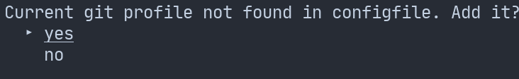

# GO2GIT-SWITCH

## Description

Have you ever used business git credentials for dummy private stuff? I do. Long story short that is how the idea behind this project was born.

The app loads your configuration from file: `"$HOME/.config/go2git-switch.yaml` which looks like:
```
profiles:
- label: Profile1
 name: Profile1
 email: profile1@example.com
- name: profile2
 email: example@profle.com
```

Pretty straightforward and simple.


If you do not have that path, do not worry. It will be handle for you.
Beside selecting git profile you also have option for creating and deleting existing entries.


## Example

### Run with custom config file
`go run . -c _docs/example.yaml`


If currently used profile does not present in config file, it will prompt to add it.



### Remove profile

## Usage
```
NAME:
   go2git-switch - little helper to easily between git profiles

USAGE:
   go2git-switch [global options] command [command options] [arguments...]

AUTHOR:
   M. Więcek

COMMANDS:
   add         add a new profile to configfile
   edit, e     edit existing profile
   remove, rm  list all profiles and select one to remove from configfile
   current     show current git profile
   help, h     Shows a list of commands or help for one command

GLOBAL OPTIONS:
   --config value, -c value  choose custom config filepath (default: "/Users/wiecekm/.config2/go2git-switch.yaml")
   --verbose, -v             if print verbose logs (default: false)
   --target value, -t value  level of git config. can be local or global (default: "global")
   --help, -h                show help (default: false)
```
