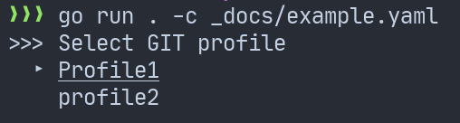

# GO2GIT-SWITCH

## Example
`go run . -c _docs/example.yaml`



## Usage
```
NAME:
   go2git-switch - TBD

USAGE:
   go2git-switch [global options] command [command options] [arguments...]

AUTHOR:
   M. Więcek

COMMANDS:
   add         TBD
   remove, rm  TBD
   current     TBD
   help, h     Shows a list of commands or help for one command

GLOBAL OPTIONS:
   --config value, -c value  TBD (default: "/Users/wiecekm/.config/go2git-switch.yaml")
   --verbose, -v             if print verbose logs (default: false)
   --target value, -t value  TBD (default: "global")
   --help, -h                show help (default: false)
```
